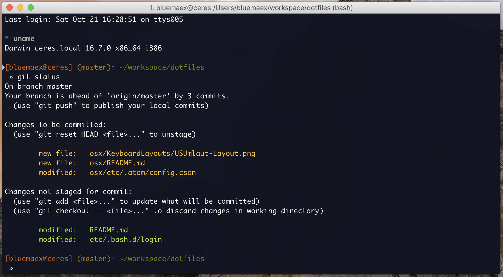

# .bluemaex aka my dotfiles

#### `bin`-folder

Contains binary files or scripts that should be executable. It will
be symlinked to `~/.bin`.
ls
#### `etc`-folder

All dotfiles that do cool stuff.

#### `osx`-folder

Configuration stuff for macOS that I regularly tend to search for again. Also contains configurations for a few apps that allow custom preference paths.

## install

Make is your friend. If you don't know how to start enter ``make help`` so you see all executable targets with a description.

## credits

Probably the credits list is not complete because it grew over the years. If you find a credit missing please ping me, I'll add it. Thank you internet for all the good dotfiles and inspirations.

### Special thanks to:

 - https://github.com/drscream/tm-env (I stole in the recent overhaul most of his bash setup, so this is basically a fork of his bash setup :)
 - https://github.com/mathiasbynens/dotfiles
 - https://github.com/ptb/mac-setup
 - https://github.com/alrra/dotfiles
 - https://apple.stackexchange.com/a/108836
