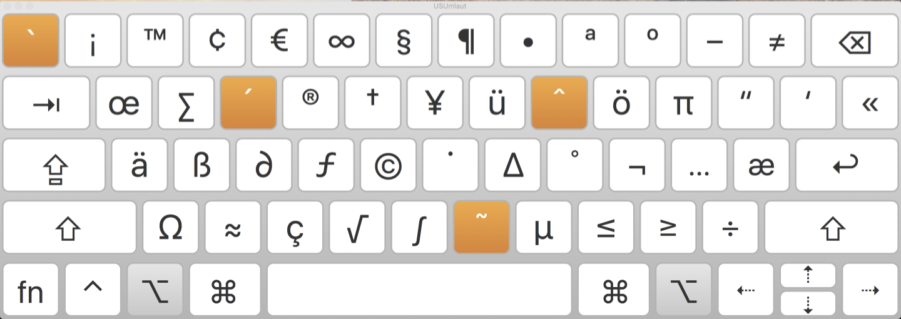

# OS X (aka macOS) specific targets

For all given targets see the list with a description when you execute
```bash
make
```

## Sensible macOS defaults

When setting up a new Mac, you may want to set some sensible macOS defaults:

```bash
make defaults
```

They are based on [.macos](https://mths.be/macos) with my own customizations and additions. You probably want to edit it before execution otherwise you get a new hostname :)

## Install Homebrew formulae

When setting up a new Mac, you may want to install [Homebrew](https://brew.sh/) and some common formulae (see [Brewfile](Brewfile)):

```bash
make homebrew
```

## Keyboard Layouts

I usually use a US-English Keyboard which is nearly perfect, but sometimes you need to access those weird german umlaut characters ``äöüß`` or the Euro-Sign ``€``. It is pretty inconvenient to enter them with a US-Layout.

With the help of [Ukulele](http://scripts.sil.org/cms/scripts/page.php?site_id=nrsi&id=ukelele) I created my own keyboard Layout called USUmlaut. Pressing Option+A gives you ä and so. See the following Screenshot for reference:



You can install it with ``make keyboard``. Afterwards you need to activate it via the System Preferences.
If you only want to use **only** this keyboard you can activate via ``make keyboard-user`` for the current user or as system default with ``make keyboard-root``

## Atom configuration

Also included here is my Atom configuration. You can easily backup and restore your included plugins with the bundled ``apm``. E.g. Installing a list of plugins is as easy as:

```
apm install --packages-file etc/.atom/Atomfile
```

## lolcommits

If you want to have some fun while commiting you can enable [lolcommits](https://lolcommits.github.io/) by default.
If you want to enable an existing clone just do a ``git init`` to update the hooks.

Yes, it is stupid, but you can thank me later :p

## Security and Privacy on a Mac

If you into that privacy thing and what to avoid your mac phoning home or are interested into securing it, those are some pretty good links to start with.

 - https://github.com/drduh/macOS-Security-and-Privacy-Guide
 - https://github.com/karek314/macOS-home-call-drop
 - https://github.com/l1k/osxparanoia
